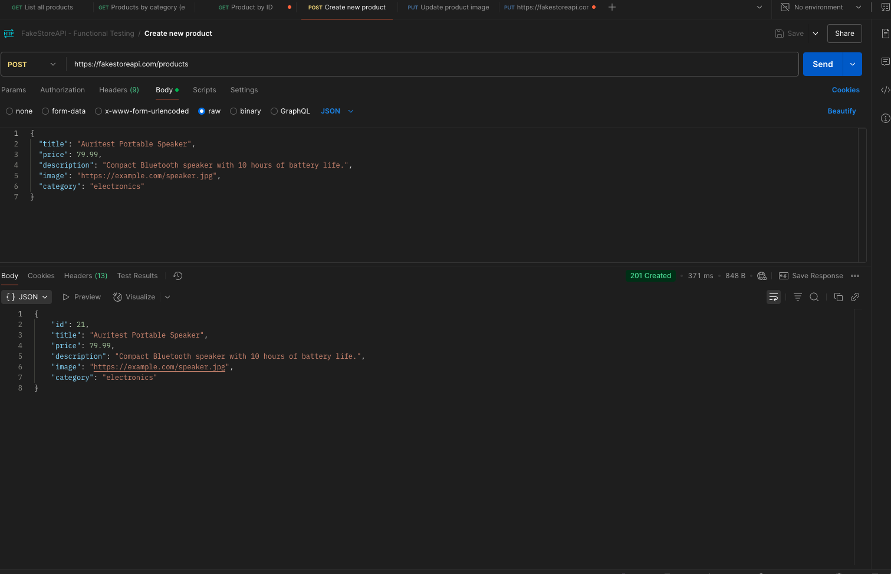

# Creación de producto

```bash
curl --location 'https://fakestoreapi.com/products' \
--header 'Content-Type: application/json' \
--data '{
  "title": "Auritest Portable Speaker",
  "price": 79.99,
  "description": "Compact Bluetooth speaker with 10 hours of battery life.",
  "image": "https://example.com/speaker.jpg",
  "category": "electronics"
}'
```




